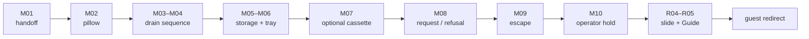

# Кабинка Павла: production media map

**Статус:** `PILOT GENERATED / QA REJECTED 0 KEEP + 3 REJECT / NOT INTEGRATED`  
**Дата:** 2026-08-29  
**Источник графа:** `content/pavel/observation-booth-content.js`, 23/23 узла  
**Граница:** карта ассетов, pilot evidence и QA; без retries, main batch и runtime integration

## 1. Locked production profile

- model: `C1`;
- aspect: landscape `16:9`;
- resolution: `540p`;
- native audio: `OFF`;
- automatic `Multi-shot`: `OFF`;
- one generation item = one continuous shot;
- duration per item: `1–15s`, fixed below;
- no lip sync, generated dialogue, readable text, logos or interface labels inside video;
- important speech, system messages and choices remain HTML text;
- every accepted MP4 must produce a local poster from an accepted frame;
- `prefers-reduced-motion` and failed-media fallback use the poster, never a blank frame;
- paid generation starts only after a live PixVerse quote and separate approval.

This is a compact continuity project, not a short film. Ten controlled shots
cover the 23-node vignette through reuse and held frames. New story beats,
extra rooms and cinematic cutaways are out of scope.

## 2. Visual bible and continuity locks

### Pavel

- eighteen-year-old, pale, tousled dark hair, deep tired shadows, soft and
  initially trustworthy face;
- in the booth he wears the worn grey Cat costume body with the mascot head
  removed; the face is visible, but the shot must not beautify him into a
  fashion portrait;
- the full-head dossier image is a costume/console reference only, not the
  approved head state for control-room shots;
- escape shot shows only a grey tail through the observation window. No full
  running figure and no proof that the Administration permitted the escape;
- acting progression: casual ownership → attentive calculation → brief
  irritation after refusal → absence. No villain grin or confession.

### Booth and rooms

- the booth is the central surveillance post, physically separate from
  cinema «Иллюзион»;
- cramped late-Soviet service architecture, aged green-grey metal, dirty
  fluorescent practical light, CRT glass, damp concrete, no modern screens;
- camera is fixed CCTV/POV with restrained analogue instability. No dolly,
  handheld chase, rack-focus glamour or internal montage;
- the right CRT may show the service corridor near «Иллюзион», but
  the cinema must never appear to be inside the booth;
- bedroom, drain, storage and hatch retain one coherent material world.

### Drain creature

- never reveal or name the complete creature;
- allowed fragments only: one pale finger with a long dirty nail, one human
  eye deeper behind the grate, wet black hair and dirty-pink vapor;
- order is locked: vague darkness → beckoning finger/eye → cough/vapor/hair
  → vague darkness;
- no mouth, full face, crawling body, tentacles, attack or jump scare.

### Senior Guide

- existing still remains locked through her dialogue;
- the accepted manual Grok exit clip begins only after `ВОЙТИ В ГОРКУ`;
- the Sun mask, black dress, frozen posture and open gloved palm do not change;
- do not explain her identity or visually imply that she arrived with Pavel.

## 3. Audited reference assets

| ID | File | Technical fact | Use | Status |
|---|---|---|---|---|
| `R01` | `assets/staff/curators/irina/cctv-pavel-observation-booth-poster.webp` | WebP, 544×544 | Pavel face, seated working posture, fluorescent CRT mood | `REFERENCE / CURRENT FALLBACK`; square, not final 16:9 master |
| `R02` | `assets/staff/documents/pavel-personnel-portrait.webp` | WebP, 1536×1024 | face, age, tiredness, grey costume body and tail | `IDENTITY LOCK` |
| `R03` | `assets/staff/documents/pavel-observation-booth.webp` | WebP, 1536×1024 | costume texture, two-monitor console, room materials | `WORLD LOCK`; full mascot head must not transfer into control shots |
| `R04` | `assets/guest/locations/pavel/storage-slide.webp` | WebP, 1672×941 | final empty storage/slide state | `LOCKED RUNTIME STILL` |
| `R05` | `assets/guest/locations/pavel/senior-guide-at-slide.webp` | WebP, 1672×941 | Senior Guide arrival, verdict and route gesture | `LOCKED RUNTIME STILL` |
| `R06` | `assets/guest/locations/pavel/senior-guide-slide-exit.mp4` | H.264/AAC, 1024×576, 10.04s | Guide gesture, slide light, POV entry, glitch | `ACCEPTED MANUAL RUNTIME VIDEO` |
| `R07` | `assets/guest/locations/pavel/storage-slide-light.webp` | WebP, 1024×576 | reduced-motion and video-failure fallback | `ACCEPTED RUNTIME STILL` |

Do not overwrite these sources. Accepted generated shots and extracted posters
go under `assets/guest/locations/pavel/` with the filenames below.

## 4. Quote-ready C1 shot list

All times are internal shot time, not game time. UI text and SFX are added by
the site. `Board/control` names source images to provide at preflight when the
selected C1 route supports them; support must be verified before spending.

| ID | Time | Scene and action | Framing / camera / light | Board/control | Output base | Paid stage | Approval |
|---|---:|---|---|---|---|---|---|
| `M01` | `00:00–00:08` | Pavel slides the operator chair toward POV, settles beside two CRTs, then watches the left screen; right signal drifts | fixed medium-wide from booth doorway, 28–35mm equivalent, dirty overhead fluorescent, almost no camera motion | `R01 + R02 + R03`; face visible, Cat head absent | `pavel-control-handoff` | pilot | `REJECT`: shot changes from corridor/wide to face close-up; fixed-camera lock fails |
| `M02` | `00:00–00:06` | empty bed; a deep pillow dent slowly releases as if someone just stood up | fixed high corner CCTV, wide lens, weak green spill from corridor; no figure enters | `R03` for material palette only | `pavel-bedroom-pillow` | main | `PLANNED` |
| `M03` | `00:00–00:07` | dark drain and wet off-axis reflection; one finger rises and beckons twice; a single eye opens deeper behind bars | locked macro/close POV, hard grate foreground, minimal focus breathing, sickly bathroom light | creature lock above; no full anatomy | `pavel-drain-beckon` | pilot | `REJECT`: multiple fingers and too much human face/eye anatomy become visible behind the grate |
| `M04` | `00:00–00:07` | finger remains; dirty-pink vapor coughs through grate, wet black hair appears for one second; finger withdraws, eye remains | same lens, axis and lighting as `M03`; continuous action, no cut | accepted `M03` frame as continuity reference | `pavel-drain-cough` | main | `PLANNED` |
| `M05` | `00:00–00:06` | dry slide entrance at far storage wall; unseen phone buzz stops as POV nears; three impacts subtly shake the closed door, nothing opens | fixed wide aisle shot, symmetrical shelves, 24–28mm equivalent, dim fluorescent pool | `R04` for room geometry, but earlier service state must be visibly distinct | `pavel-storage-service` | main | `PLANNED` |
| `M06` | `00:00–00:06` | tray hatch opens only a handspan; an empty plate arrives; folded note is visible underneath; no hand or person remains | fixed waist-height close-wide, reinforced glass and hatch dominate, no readable generated writing | `R03` palette; exact note remains HTML/action text | `pavel-hatch-tray` | main | `PLANNED` |
| `M07` | `00:00–00:05` | pillowcase edge lifts enough to reveal an old grey-label VHS cassette; no hand enters frame | fixed close shot, same bedroom and light as `M02`, restrained fabric movement | accepted `M02` poster for bedroom continuity | `pavel-bedroom-cassette` | main | `PLANNED` |
| `M08` | `00:00–00:08` | right CRT flickers with a service corridor near the separate cinema; Pavel watches POV, glances away, then holds still as patience thins | fixed medium close from player chair, screen glow on face, no speech/lip sync; no cinema signage text | accepted `M01` + `R02`; identical face and costume state | `pavel-control-camera` | main | `PLANNED` |
| `M09` | `00:00–00:05` | lock clicks behind the door; only a grey Cat tail crosses the narrow observation window; corridor becomes empty | fixed shot centered on door/window, tail visible for less than one second, no body or face | `R02` tail/costume texture, `R03` service materials | `pavel-hatch-escape` | pilot | `REJECT`: tail-only reveal holds, but the camera visibly pushes into the window instead of remaining fixed |
| `M10` | `00:00–00:06` | empty operator chair slowly turns toward POV after the failed door; CRT light continues without Pavel | same booth axis as `M01`, fixed camera, mechanical chair motion only; no generated system text | accepted `M01` empty plate | `pavel-operator-hold` | main | `PLANNED` |

### Output package per accepted shot

For every `M##`:

```text
assets/guest/locations/pavel/<output-base>.mp4
assets/guest/locations/pavel/<output-base>-poster.webp
```

The MP4 must be silent, browser-playable H.264 or another currently supported
site profile confirmed at integration. Poster extraction, optimization and
runtime wiring are local integration work, not additional generation items.

## 5. Node-to-media map

| # | Node | Visual state after integration | Playback rule | Audio/text relation |
|---:|---|---|---|---|
| 1 | `booth-intro` | `M01` video | play once; hold final frame | channel static optional; Pavel remains text-only |
| 2 | `booth-sound-ack` | `M01` poster/final frame | no replay required | short chain remains visible action text |
| 3 | `control-laugh` | `M01` final frame | hold | distant laugh one-shot + visible system fallback |
| 4 | `bedroom-check` | `M02` video | play once | pillow change carries the anomaly without sound dependency |
| 5 | `dev-drain-fragment` | `M03` first-frame poster | hold vague drain | drain hum optional; transcript visible |
| 6 | `drain-beckon` | `M03` video | play once | `Тут сыро.` stays HTML transcript |
| 7 | `drain-cough` | `M04` video | play once | complete drain monologue stays HTML; future voice is a separate audio batch |
| 8 | `drain-password` | `M04` final-frame poster | hold eye/residue after finger withdraws | `Везёт.` remains text |
| 9 | `drain-silent` | `M03` first-frame poster | return to vague darkness | silence is intentional |
| 10 | `control-after-drain` | `M01` final frame | hold | phone buzz one-shot; Pavel text-only |
| 11 | `storage-check` | `M05` video | play once | phone stops; door impacts may remain separate SFX |
| 12 | `hatch-tray` | `M06` video | play once | note wording must not be generated inside image |
| 13 | `control-after-hatch` | `M08` first 2–3s or poster | short replay allowed | close laugh is separate SFX candidate; Pavel text-only |
| 14 | `bedroom-cassette` | `M07` video | play once | cassette remains optional and is not auto-played |
| 15 | `control-camera` | `M08` video, then held frame | play once on entry; refusal must not restart it | both Pavel lines stay HTML; right channel is `Иллюзион` corridor only |
| 16 | `hatch-escape` | `M09` video | play once, no loop | lock/click SFX separate; grey tail is the only Pavel fragment |
| 17 | `dev-operator-hold` | `M10` video | play once | `ОПЕРАТОР ПРИНЯТ` remains HTML system text |
| 18 | `operator-last-check` | `M10` final-frame poster | hold | wet scrape separate SFX candidate, no extra video |
| 19 | `storage-slide-empty` | `R04` still | existing still, no generation | empty slide is the visual answer |
| 20 | `senior-guide-arrives` | `R05` still | existing still, no animation | sudden presence is stronger than an entrance shot |
| 21 | `senior-guide-verdict` | `R05` still | hold | frozen mask supports the unchanged verdict |
| 22 | `senior-guide-route` | `R05` still | hold | existing open palm already points toward slide |
| 23 | `slide-guest-light` | `R06` video; `R07` reduced-motion hold | play once after `ВОЙТИ В ГОРКУ`; voluntary audio | `video.ended` completes the shift and redirects to guest; fallback keeps the manual `ВЫЙТИ` route |

## 6. Interactive timeline



Player reading and choices sit between every asset. The generated runtime is
therefore roughly 64 seconds of unique motion inside a 5–8 minute vignette;
it must not be edited into a continuous film.

## 7. Audio reuse map

Technical duration is verified; semantic fitness is not inferred from a
filename and must be auditioned before final lock.

| Runtime ID / candidate | File | Duration | Proposed role | Decision |
|---|---|---:|---|---|
| `test-channel-static` | `assets/audio/staff/cctv/channel-static.mp3` | 1.358s | initial channel acknowledgement | `KEEP TEMP`, audition with `M01` |
| `test-distant-laugh` | `assets/audio/curator/sfx/child-laugh-distant.mp3` | 4.224s | first bedroom signal | `KEEP TEMP`, already has text fallback |
| close-laugh candidate | `assets/audio/curator/sfx/child-laugh-close.mp3` | 4.032s | second bedroom signal at `control-after-hatch` | `AUDITION / NOT WIRED` |
| `test-drain-hum` | `assets/audio/guest/red-room/espresso-water.mp3` | 1.045s | drain vibration | `TEMP / SEMANTIC RISK`; replace only after audition |
| `test-phone` | `assets/audio/guest/red-room/shift/sfx-phone-buzz.mp3` | 1.646s | unseen storage phone | `KEEP TEMP` |
| `test-paper` | `assets/audio/guest/red-room/shift/sfx-paper-unfold.mp3` | 1.228s | currently fires before the tray note | `REMAP CANDIDATE`; better at `hatch-tray`, not proof of a new story beat |
| `test-door` | `assets/audio/guest/red-room/shift/sfx-door.mp3` | 2.038s | hatch/lock movement | `KEEP TEMP`, check repetition |
| `test-click` | `assets/audio/staff/cctv/remote-button-click.mp3` | 1.149s | right-channel button | `KEEP` if audition confirms tactile fit |
| static bed candidate | `assets/audio/staff/cctv/tv-static-loop.mp3` | 10.867s | optional low-level monitor texture | `DO NOT LOOP BY DEFAULT`; silence remains the dramatic baseline |
| drain human voice | not generated | n/a | only potentially voiced character | `SEPARATE ELEVENLABS PREFLIGHT`; excluded from C1 quote |

No audio file is copied or renamed in the media-map stage.

## 8. Quote batches and checkpoints

### Pilot quote

| Items | Unique duration | Why these first |
|---|---:|---|
| `M01`, `M03`, `M09` | `20s` total | proves Pavel identity/booth continuity, partial-creature control and the escape payoff before the larger spend |

Stop after all three previews. Inspect each at native resolution and reject
the batch if identity, room geometry or partial-reveal discipline fails.

### Main quote

| Items | Unique duration | Dependency |
|---|---:|---|
| `M02`, `M04`, `M05`, `M06`, `M07`, `M08`, `M10` | `44s` total | only after the pilot supplies accepted Pavel, drain and booth references |

### Total quote envelope

- `10` C1 generation items;
- `64s` unique generated motion;
- `10` local poster extractions, no extra generation;
- `0` audio generations;
- `0` new Senior Guide shots;
- `0` integrations, retries or upscales included until separately quoted.

Credits/currency are intentionally absent: a live PixVerse preflight must
resolve current account, capability and price. Do not infer cost from model
names or old notes.

### Live pilot preflight snapshot

Quote captured at `2026-08-29T14:52:03Z` (`09:52 CDT`):

- queue: `projects/pavel-observation-booth/pilot-queue.json`;
- prompts: `projects/pavel-observation-booth/prompts/m01-control-handoff.txt`,
  `m03-drain-beckon.txt`, `m09-hatch-escape.txt`;
- authenticated: yes; workspace: `Personal`;
- membership reported by PixVerse: `Standard`; effective route: `premium`;
- entitlement: `compatible`; issues: none;
- balance snapshot: `1568 credits`, state `has_credits`;
- exact scope: three videos, one generation each; two `reference` tasks and
  one text-to-video task; total planned duration `20s`;
- all three use `pixverse-c1`, `540p`, `16:9`, audio off; the text-to-video
  item also records `no_multi_shot=true`, while reference mode exposes no
  Multi-shot switch and therefore cannot enable it;
- exact pre-generation credits: `not_available` from the provider;
- confirmation: required; this is the first paid generation in the project;
- generation started: no.

The live quote is exact about task count, model, parameters, membership,
entitlement and balance. It cannot truthfully state an exact charge before
render because PixVerse does not expose one. Actual credits must be reconciled
from account usage after generation.

### Pilot generation invoice and QA

Approved and generated on 2026-08-29. Queue result: `3/3` technically ready,
`0` failed, `0` unresolved. Creative QA result: `0 KEEP / 3 REJECT`.

| ID | PixVerse task | Local audit preview | Actual credits | Technical QA | Creative QA |
|---|---|---|---:|---|---|
| `M01` | `421669023608410` | `projects/pavel-observation-booth/assets/videos/421669023608410/pixverse_video_421669023608410_1788015526338.mp4` | `48` | H.264, 1024×576, 24 fps, 8.042s, no audio | `REJECT`: corridor/wide-to-close shot change and strong camera move; fixed medium-wide contract is lost |
| `M03` | `421669025076447` | `projects/pavel-observation-booth/assets/videos/421669025076447/pixverse_video_421669025076447_1788015488326.mp4` | `42` | H.264, 1024×576, 24 fps, 7.042s, no audio | `REJECT`: several fingers and a broad facial reveal replace the locked single-finger/single-eye fragment |
| `M09` | `421669036274919` | `projects/pavel-observation-booth/assets/videos/421669036274919/pixverse_video_421669036274919_1788015507565.mp4` | `30` | H.264, 1024×576, 24 fps, 5.042s, no audio | `REJECT`: grey tail is the only figure fragment, but the camera pushes from the door into the window |

Invoice: `120 credits` total; live balance changed `1568 → 1448`. Per-task
records and the observed balance delta agree. Rejected files stay in the
project workspace as paid audit evidence; they are not copied into public
assets and do not authorize retries. Any retry requires a revised prompt,
new live quote and explicit approval.

## 9. Reject conditions

Reject an item before integration if any of these appear:

- Pavel looks older than eighteen, changes face, gains/loses costume pieces,
  or wears the full Cat head in control-room shots;
- the Cat tail becomes a separate animal or exposes Pavel's full escape route;
- «Иллюзион» becomes part of the booth rather than a remote camera feed;
- modern flat panels, polished sci-fi UI, readable generated labels or logos;
- camera movement, cuts or shot changes inside a supposedly continuous item;
- a full drain creature, attack, mouth, extra eyes/fingers, clean theatrical
  pink smoke or comic monster acting;
- Senior Guide is regenerated, animated into an entrance, or linked directly
  to Pavel;
- a generated shot contains indispensable information absent from visible text;
- poster does not preserve the accepted frame or fails at `390×844` crop.

## 10. Integration gate after generation

Generation approval does not authorize runtime edits. After accepted files
exist, integration is a separate write stage:

1. inspect downloaded media and record dimensions, codec, duration and hashes;
2. derive posters from accepted frames and optimize for browser playback;
3. expand visual IDs without changing node order or literary copy;
4. keep one dedicated element per active shot and stop playback on node change;
5. refusal at `control-camera` keeps the held `M08` frame instead of replaying;
6. add every new public file to build/verification allowlists;
7. verify poster, missing-MP4 and reduced-motion fallbacks;
8. run desktop and `390×844` browser QA, resume, cassette branches, console and
   guest redirect;
9. do not commit, push or publish without a separate request.
